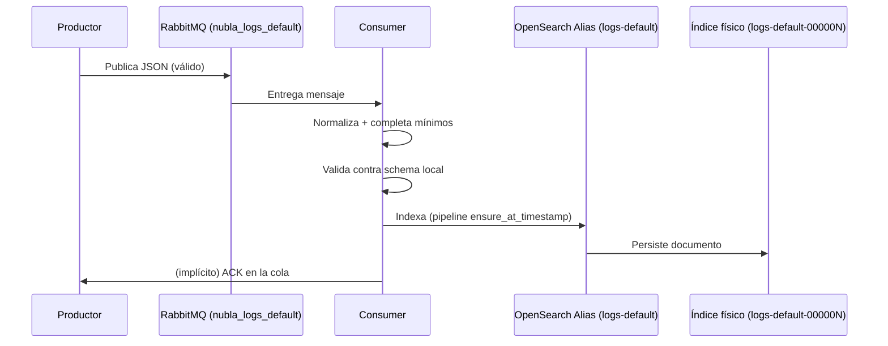
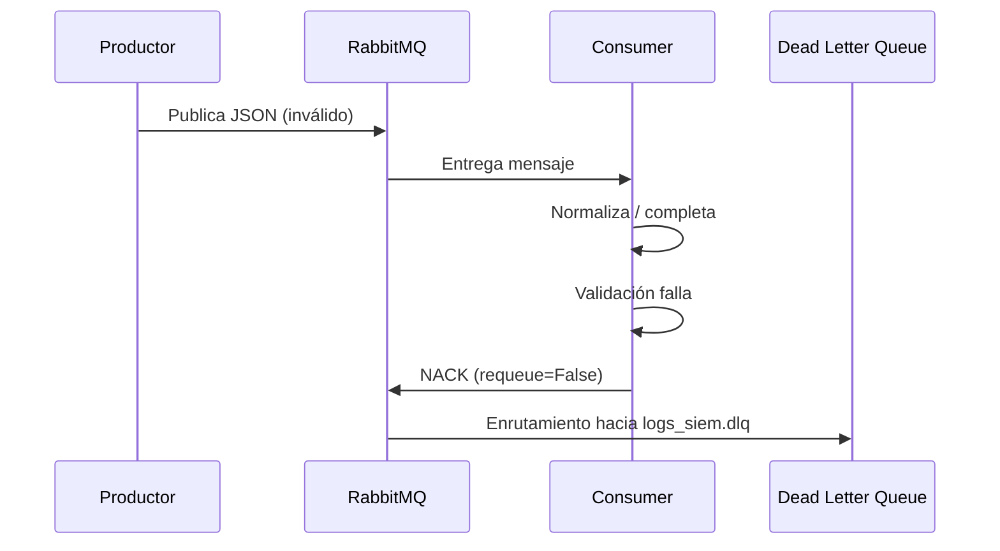

# Secuencia Detallada de Procesamiento

## Secuencia para un Evento Válido

## Secuencia para un Evento Inválido

## Pasos Internos Consumer

1. `json.loads(body)`
2. `normalize(raw)` (actualmente passthrough)
3. Completa:
   - `@timestamp`
   - `dataset`
   - `schema_version`
4. Convierte `datetime` → ISO string.
5. Valida JSON Schema:
   - Si errores → log `validation_failed`
   - NACK → DLQ
6. Si OK → `index_event(... pipeline="ensure_at_timestamp")`
7. Log `event_indexed`.

## Campos Críticos

| Campo | Origen | Motivo |
|-------|--------|--------|
| @timestamp | Productor o generado | Orden temporal / búsqueda |
| tenant_id | Productor | Segmentación multi-tenant |
| severity | Productor | Priorización / alertas |
| dataset | Productor o default | Clasificación funcional |
| schema_version | Productor o default | Evolución controlada |
| message | Productor | Texto descriptivo |

## Errores Comunes Abordados

| Error | Solución |
|-------|----------|
| Falta @timestamp | Consumer + pipeline set |
| datetime objeto | `coerce_datetimes` |
| severity None | Validación schema (rechazo) |
| pipeline truncado | Versionado JSON en repo |
| rollover 406 | Agregar `Content-Type: application/json` |
| ISM falla rollover_alias | Setting en índice / template |
